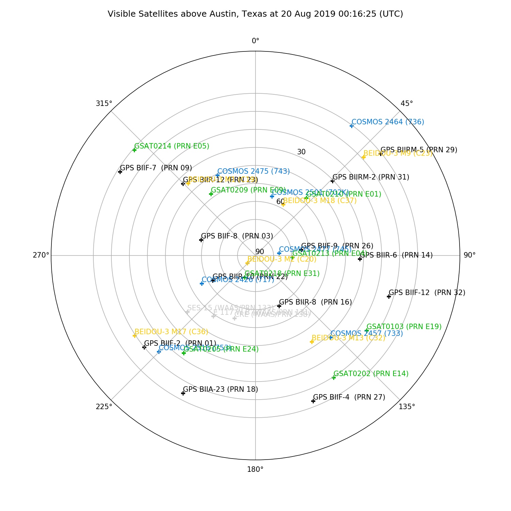
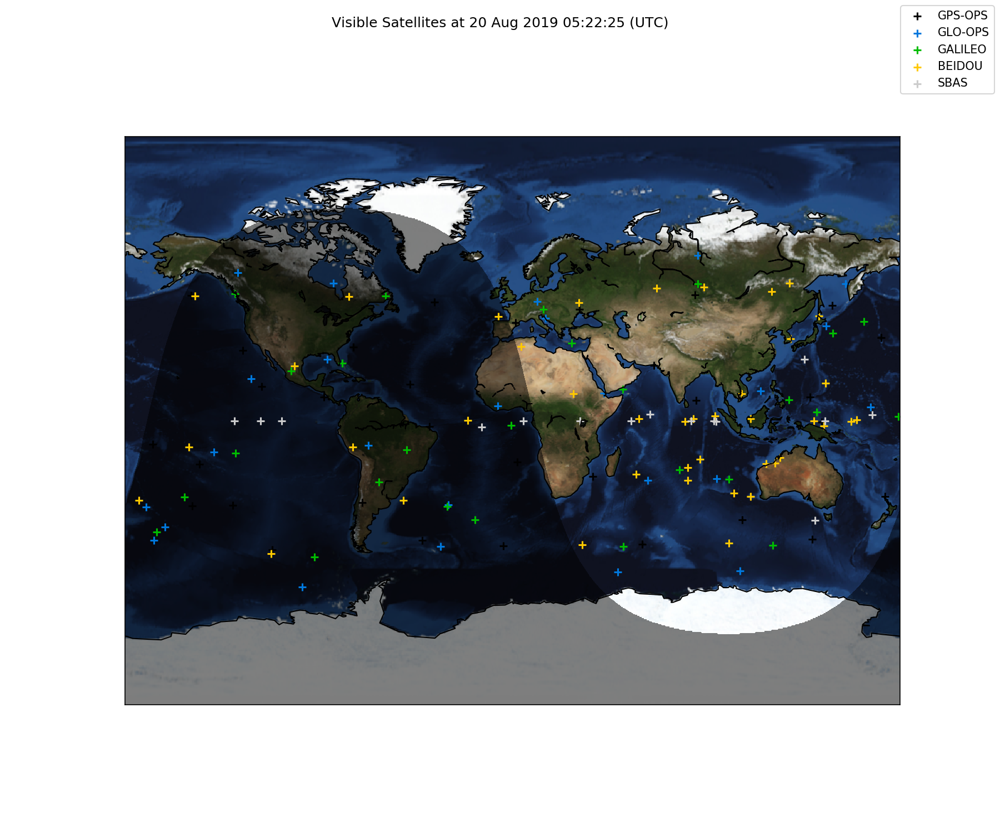

# About

Plots the current locations of GNSS satellites in the sky.

`Polar Elevation/Azimuth (using location from IP address)`



`Ground Tracks`



# To Download

```bash
$ git clone
```

# To Install

## Install Conda (Recommended)

The recommended virtual environment and package management tool for this package is `conda`. 
There are two options for installing conda, `miniconda` and `anaconda`.  `Anaconda` is a full-fledged 
virtual environment and dependency manager and can be downloaded [here](https://www.anaconda.com/download/). 
Alternatively, `miniconda` is a lightweight (and less bloated) version of `anaconda` and can be 
downloaded [here](https://conda.io/en/latest/miniconda.html). `Miniconda` does not provide the 
convenience of having hundreds of Python packages installed at once (like `anaconda`), but takes 
up much less disk space and might also result in zippier performance.

## Create Environment

If you are using `conda`, you can create an isolated virtual environment with all the necessary 
dependencies by executing the following command:

```bash
$ conda env create -f env_satmap.yml
```

## Install Package

Finally, `pip` install the `satmap` package:

```bash
$ pip install .
```

## To Use

```bash
$ plot_sats -h
```

## To Test

Put stuff about future unit tests here.
